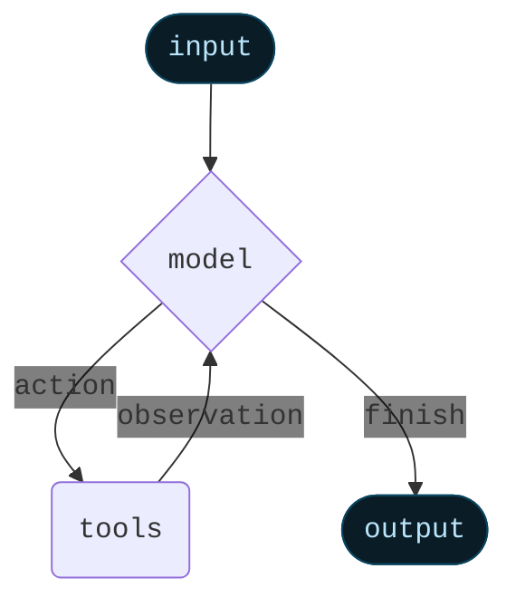

```mermaid
%%{
  init: {
    "fontFamily": "monospace",
    "flowchart": {
      "curve": "curve"
    },
    "themeVariables": {"edgeLabelBackground": "transparent"}
  }
}%%
graph TD
  %% Outside the agent
  QUERY([input])
  LLM{model}
  TOOL(tools)
  ANSWER([output])

  %% Main flows (no inline labels)
  QUERY --> LLM
  LLM --"action"--> TOOL
  TOOL --"observation"--> LLM
  LLM --"finish"--> ANSWER

  classDef blueHighlight fill:#0a1c25,stroke:#0a455f,color:#bae6fd;
  classDef greenHighlight fill:#0b1e1a,stroke:#0c4c39,color:#9ce4c4;
  class QUERY blueHighlight;
  class ANSWER blueHighlight;
```